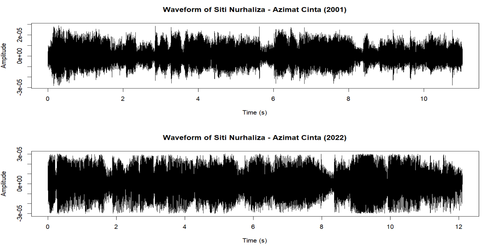
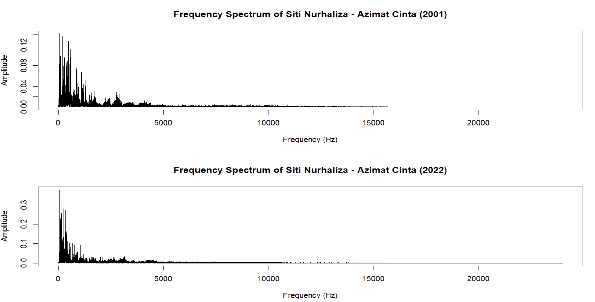
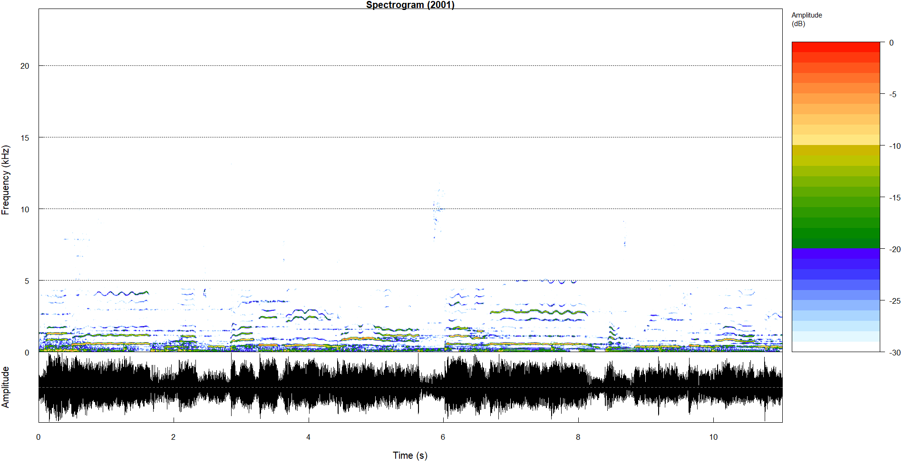
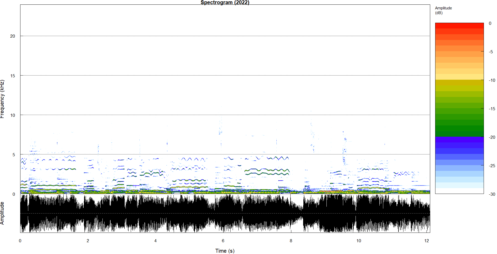

# <div align="center">Voice Aging Analysis: A Study on Siti Nurhaliza's Voice Using FFT and STFT
# <div align="center"></div>

## 🎵 Azimat Cinta Lyric 🎤
>Cahaya cinta menyinar
>
>Berkilauanlah selautan kasih
>
>Bercahaya
>
>Bagaikan butiran permata
>
>Seolah-olah terapung dipermukaannya
>
>Daku menjejaki pantai rindu
>
>Mengutip kasih yang terdampai
>
>Kau merantaikannya satu demi satu
>
>Dengan kasih sayang mu
>
>Kini menjadi kalungan azimat cintaku
>
>Walau tidak dibasahi hujan
>
>Namun tempiasnya menyegarkan
>
>Biarpun rembulan tidak di ribaan
>
>Namun cahayanya cukup menerangi bayangan
>
>Harumlah cinta di jiwa
>
>Sewangi kasturi syurgawi
>
>Semoga bahagia jadi milik kita
>
>Nan abadi selama-lamanya
>
>Daku menjejaki pantai rindu
>
>Menyaksikan rintihan berlalu
>
>Ombak resah yang menghempas diri
>
>Hanyutkanlah kedukaan
>
>Bawalah jauh dari pada bayangan
>
>Walau tidak dibasahi hujan
>
>Namun tempiasnya menyegarkan
>
>Biarpun rembulan tidak di ribaan
>
>Namun cahayanya cukup menerangi bayangan
>
>Harumlah cinta di jiwa
>
>Sewangi kasturi syurgawi
>
>Semoga bahagia jadi milik kita
>
>Nan abadi selama-lamanya
>
>Andai sinar mentari
>
>Terlindung di balik redupan awanan
>
>Yang berlabuh
>
>Singkaplah tirai kasihmu
>
>Agar bisa ia menyinarkan cahayanya
>
>Untuk kita berdua
>

## Introduction
This study compares the vocal characteristics of Siti Nurhaliza in 2001 and 2022 by analysing the song "Azimat Cinta." The analysis includes waveform analysis, Fourier Transform (FFT), Short-Time Fourier Transform (STFT), and average spectrum analysis to identify changes due to aging.


## Data
Audio recordings of “Azimat Cinta” from 2001 and 2022 were obtained for analysis from two YouTube videos. The first video featured Siti Nurhaliza’s voice from the original 2001 recording (https://www.youtube.com/watch?v=tn6YW0fXQvg), while the second video was taken on her recent voice in 2022 (https://www.youtube.com/watch?v=Rj0KhqoU3dQ). These videos were trimmed using (https://audiocutter.online/) to extract segments from minute 1:45 to 1:56 and minute 5:30 to 5:41. The selected recordings represent the vocal quality of Siti Nurhaliza over a span of two decades. Various techniques were applied to the audio files to provide a comprehensive comparison of the recordings.

## Analysis

### 1. **Wave Signal Analysis**:
```R
# Step 1: Load and Visualize Waveforms

 library(tuneR)
library(seewave)
library(ggplot2)

# Load audio files
audio_2001 <- readWave("C:/Users/User/UKM - Nur Azlin Binti Rusnan/Sem 2/Unstructured Data/Project 3/Task_2/Audio/Siti Nurhaliza_Azimat Cinta_2001_cut.wav")
audio_2022 <- readWave("C:/Users/User/UKM - Nur Azlin Binti Rusnan/Sem 2/Unstructured Data/Project 3/Task_2/Audio/Siti Nurhaliza_Azimat Cinta_2022_cut.wav")

# Normalize audio data
audio_2001 <- normalize(audio_2001, unit = "32")
audio_2022 <- normalize(audio_2022, unit = "32")
play(audio_2001)
play(audio_2022)

# Step 1: Wave Signal Analysis
# We will plot the waveforms of both audio files to visualize the wave signals.

plot_wave_signal <- function(audio, title) {
  audio_data <- audio@left / 32768
  time <- seq(0, length(audio_data) - 1) / audio@samp.rate
  plot(time, audio_data, type = "l", xlab = "Time (s)", ylab = "Amplitude", main = title)
}

# Plot Wave Signals
par(mfrow = c(2, 1))
plot_wave_signal(audio_2001, "Waveform of Siti Nurhaliza - Azimat Cinta (2001)")
plot_wave_signal(audio_2022, "Waveform of Siti Nurhaliza - Azimat Cinta (2022)")
```


The wave signal plot reveals significant differences in amplitude variations between the two recordings. The younger voice (2001) showing higher peaks and more pronounced fluctuations, suggesting a less refined vocal technique at the time. This variability indicates that Siti Nurhaliza’s voice was more dynamic but less controlled in her earlier years. On the other hand, the current voice (2022) shows more consistent amplitude patterns, reflecting improved control and vocal technique. 

### 2. **FFT Analysis**: 
```R
# Step 2: Fourier Transform (FFT) Analysis
# We will perform FFT to analyze the frequency components of the audio signals.

plot_frequency_spectrum <- function(audio, title) {
  audio_data <- audio@left / 32768
  n <- length(audio_data)
  freq <- (0:(n - 1)) * (audio@samp.rate / n)
  fft_data <- abs(fft(audio_data))
  plot(freq[1:(n / 2)], fft_data[1:(n / 2)], type = "l", xlab = "Frequency (Hz)", ylab = "Amplitude", main = title)
}

# Plot Frequency Spectrum
par(mfrow = c(2, 1))
plot_frequency_spectrum(audio_2001, "Frequency Spectrum of Siti Nurhaliza - Azimat Cinta (2001)")
plot_frequency_spectrum(audio_2022, "Frequency Spectrum of Siti Nurhaliza - Azimat Cinta (2022)")
```


The plot display the FFT magnitude spectra highlight a noticeable shift in the fundamental frequency and a reduction in harmonic richness in the current voice compared to the younger voice. The 2001 recording displays a higher fundamental frequency and more pronounced harmonic peaks, indicating a vibrant and rich vocal quality. In contrast, the 2022 recording shows a lower fundamental frequency and fewer harmonics, which may suggest a natural aging process in the vocal cords, leading to a lower pitch and reduced vocal brightness. 

### 3. **STFT Analysis**:
```R
# Step 3: Short-Time Fourier Transform (STFT) Analysis
# We will perform STFT to analyze how the frequency content of the audio signals changes over time.

plot_spectrogram <- function(audio, title) {
  spectro(audio, wl = 1024, ovlp = 50, osc = TRUE, main = title)
}

# Plot Spectrogram
par(mfrow = c(2, 1))
plot_spectrogram(audio_2001, "Spectrogram (2001)")
plot_spectrogram(audio_2022, "Spectrogram (2022)")
```



The spectrograms provide a visual representation of how the frequency content of the voice changes over time. The 2001 recording shows a higher concentration of energy in the lower frequencies (below 5 kHz), indicating a stronger and clearer voice. The energy distribution suggests that the younger voice had more power and clarity. In contrast, the 2022 recording, while still showing energy in the lower frequencies, exhibits less intensity. This suggests that the current voice is softer and more controlled, which may reflect both the natural aging process and an evolution in vocal technique towards a more refined and controlled style.

## Discussion

The FFT and STFT analyses show several important changes in Siti Nurhaliza's voice due to aging. First, the fundamental frequency has decreased, which is common as vocal cords thicken and elongate with age. Second, the harmonic richness has lessened, indicating a reduction in vocal flexibility and power.

These findings align with previous studies on voice aging. The decrease in fundamental frequency and harmonic richness can be linked to physiological changes in the vocal folds and surrounding structures. As people age, their vocal folds lose elasticity, and the muscles in the larynx weaken, leading to changes in vocal pitch and quality.

The STFT results offer additional insights into the dynamic aspects of voice aging. The spectrograms show that the formants in the current voice are less intense and more widely spread out. This suggests changes in the resonance characteristics of the vocal tract, which can affect the perceived clarity and timbre of the voice, making it sound more aged.

## Conclusion

Our analysis of Siti Nurhaliza's voice recordings from 2001 and 2022 reveals significant changes in her vocal range over time. The waveform analysis indicates improved vocal control and consistency in the current voice. The FFT analysis shows a natural lowering of the fundamental frequency and a reduction in harmonic richness in the current voice, 
